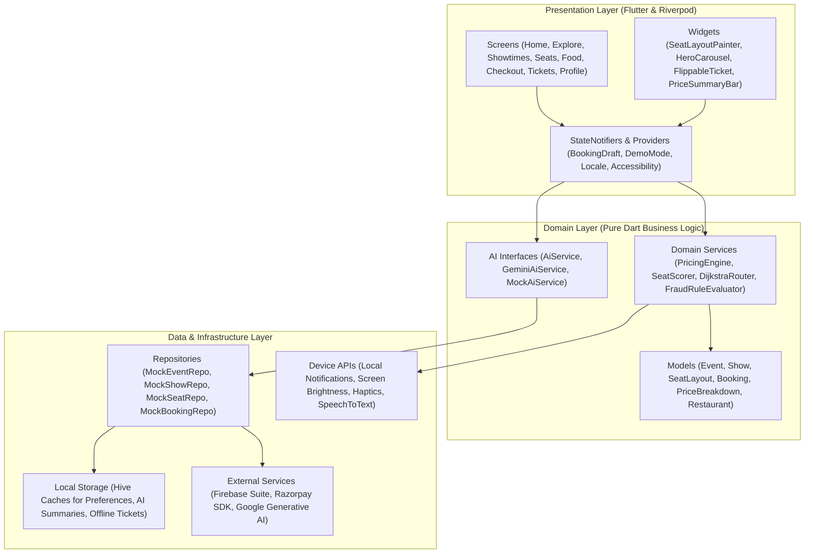
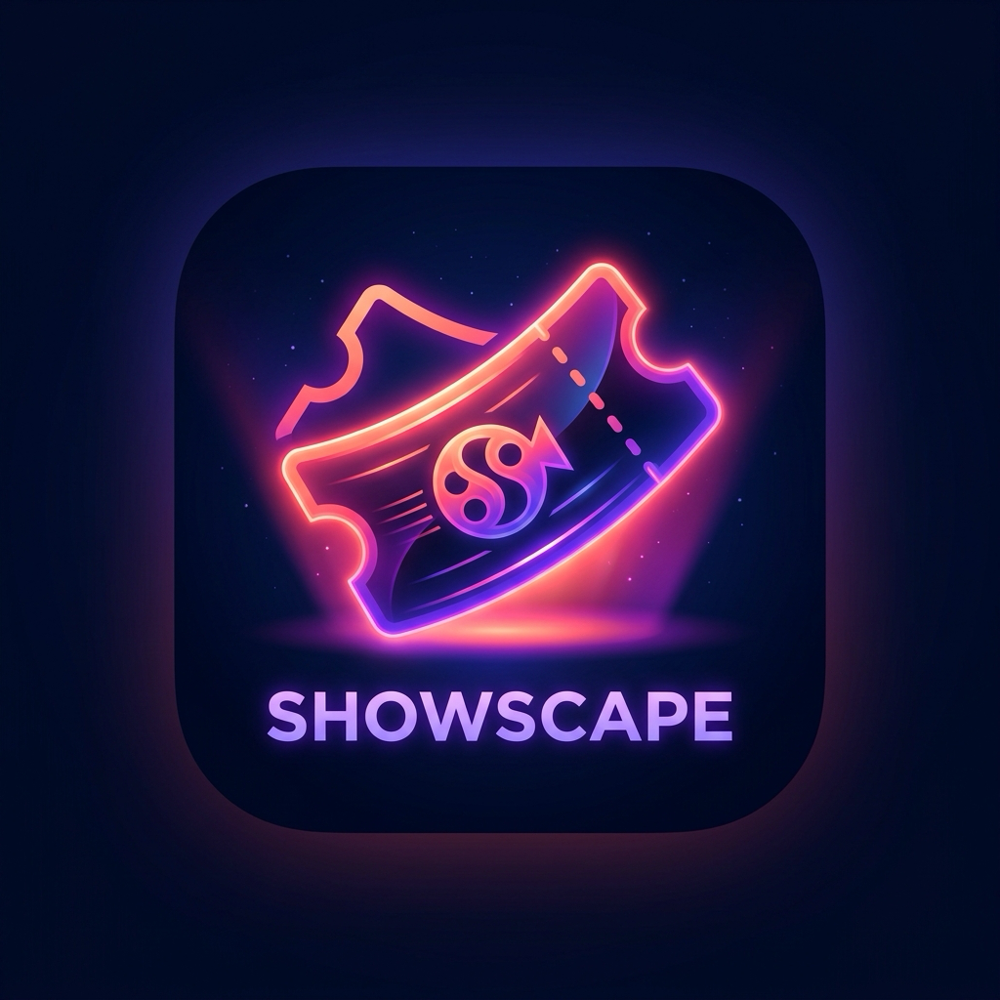

# ShowScape 🎟️✨
> **AI-First Going-Out Discovery & Entertainment Ticketing Platform**  
> *Built with Flutter, Riverpod, Google Gemini Vertex AI, and Clean Architecture*

---

## 🌟 Overview

**ShowScape** is a next-generation entertainment discovery and ticketing platform designed for movies, concerts, live sports, standup comedy, and dining. Engineered to redefine the "going-out" experience, ShowScape integrates conversational AI concierge services, intelligent seat recommendation algorithms, dynamic pricing rules, contactless anti-fraud digital tickets, venue wayfinding, and smart transit notifications into a fluid, accessible mobile experience.

---

## 🏗️ Architecture & Technology Stack

ShowScape adheres to **Clean Architecture** and reactive state management powered by **Riverpod**:



---

## 🚀 Case Study 146 Features Matrix

### 1. 🤖 AI Concierge & Intelligent Discovery
* **Scout AI Assistant**: Conversational agent supporting voice-to-text queries, multi-turn plan generation, personalized event suggestions, and direct booking shortcuts.
* **"What People Say" AI Summarizer**: Condenses top 20 verified reviews into 3 punchy bullet points and a spoiler-free verdict using Gemini with deterministic genre-backed fallbacks.
* **Mood-Based Exploration**: AI-tagged mood chips (*chill, laugh, thrill, date_night, family, music*) with Hive daily caching for instant offline retrieval.

### 2. 📅 Showtimes & Dynamic Pricing Engine
* **Dynamic Date Strip**: 7-day horizontal selection with date auto-alignment and day indicators (*Today, Tomorrow, Weekday*).
* **Occupy & Time Filters**: Filter by time of day (*Morning, Afternoon, Evening, Night*), audio formats (*IMAX 2D, 3D, 4DX*), and languages.
* **Occupancy Color Coding**: Real-time visual density chips (*Available, Filling fast, Almost full, Sold out*).
* **Mini Seat Map Preview**: Long-press on any showtime chip to preview screen layout before navigating.
* **PricingEngine**: Pure Dart calculation engine applying:
  * **Tuesday Deal**: Up to 70% movie ticket discount on low-occupancy shows.
  * **Group Discount**: Automatic 10% off for bookings of $\ge 10$ tickets.
  * **Gold VIP Perks**: 100% waiver of convenience fee and GST.

### 3. 💺 High-Performance Custom Seat Map
* **Interactive 60fps Canvas**: Pinch-zoom ($0.8\times - 3.0\times$) and pan powered by `CustomPainter` with `RepaintBoundary` isolation.
* **SeatScorer AI**:
  * Smart adjacent seat grouping with center-view and eye-level row optimization.
  * Learns user aisle preference from historical booking patterns.
  * "Best for you" one-tap automated seat block selector.
* **Orphan Seat Rule**: Enforces cinema business logic preventing single isolated empty seats.
* **8-Minute Hold Timer**: Live animated reservation countdown releasing seats if checkout is not completed.

### 4. 🍿 F&B Concessions & Dining Integration
* **In-Seat Delivery or Counter Pickup**: Pre-order hot snacks with timing options (*Intermission Delivery* or *Express Pickup*).
* **Smart Combo Recommender**: Auto-suggests food combos tailored to the exact number of selected seats.
* **"Dine After the Show"**: Curated restaurant discovery near the venue with instant table reservation sheets and exclusive Gold member dining deals.

### 5. 🎟️ Offline Tickets, Dynamic QR & P2P Transfers
* **Dynamic Anti-Fraud QR Code**: Cryptographically signed HMAC-SHA256 entry pass refreshed every 15 seconds with animated scan line to defeat static screenshots.
* **3D Flip Stub Card**: Smooth perspective 3D card flip between ticket stub overview and digital admission barcode.
* **Offline Vault**: Encrypted Hive storage allowing complete ticket access and validation without cellular signal.
* **Screen Brightness Auto-Boost**: Automatically boosts device screen brightness upon opening the pass for instantaneous turnstile scanning.
* **Peer-to-Peer Ticket Transfers**:
  * 30-minute pre-show cutoff lock.
  * Anti-scalping burst velocity limit (maximum 5 transfers in 10 minutes).
  * 24-hour non-contact cap ($>20$ transfers flags account).
* **Staff Gate Scanner**: In-app QR code scanner with camera and manual code fallback for venue attendants.

### 6. 🚗 Smart Transit & Notification Centre
* **Smart "Leave-Now" Alerts**: Calculates Haversine distance and travel duration with 15-minute venue buffer.
* **Multi-Stage Reminder Pipeline**: Automated local notifications dispatched at 24 hours, 3 hours, and 45 minutes before curtain call.
* **Notification Centre**: Dedicated inbox with read/unread tracking, category filters (*reminders, transit, transfers*), and deep-linking.

### 7. ♿ Accessibility (a11y) & Visual Polish
* **TalkBack Semantics**: Every seat, showtime chip, QR code, and map amenity annotated with rich screen-reader labels.
* **Target Size Compliance**: All interactive touch targets guaranteed $\ge 48\times 48\text{ dp}$.
* **WCAG 2.1 AA Contrast**: Contrast ratio $\ge 4.5:1$ verified across both Dark and Light themes.
* **200% Text Scaling**: Fluid typography designed to scale gracefully without UI overflow.
* **Large Text & Simple Mode**: One-tap toggle in Profile configuring $1.35\times$ base font scale and high-contrast single-column cards on Home.
* **Motion Accessibility**: All standard animations $\le 350\text{ ms}$, automatically shortening or disabling when `Reduce motion` (`MediaQuery.disableAnimations`) is detected.

---

## 🔒 Hidden Demo Mode (Case Study 146)

ShowScape includes a built-in **Demo Mode** designed specifically for live presentations and stakeholder reviews:

1. Navigate to the **Profile** tab.
2. Scroll to the bottom and **tap the ShowScape logo 5 times in rapid succession**.
3. A heavy haptic pulse activates the **Demo Mode Control Panel**:
   - 🛡️ **Mock Services**: Forces `MockAiService` and `MockPaymentService` for 100% deterministic, offline-capable demos.
   - 🏷️ **Set Today to Tuesday**: Forces Tuesday discount calculations across all screens and displays the live Tuesday Deals banner.
   - 👑 **User = Gold VIP**: Toggles Gold membership instantly, applying ₹0 convenience fees and displaying the VIP badge.
   - 🔔 **10-Second Reminder Trigger**: Fires a live local notification in 10 seconds (`"🍿 ShowScape Demo: Showtime Alert!"`) with sound and system banner.

---

## 🛠️ Setup & Execution Instructions

### Prerequisites
- Flutter SDK `3.29.0` or higher
- Dart SDK `3.5.0` or higher
- Android Studio / Xcode / VS Code with Flutter extensions

### 1. Clone & Install Dependencies
```bash
git clone https://github.com/your-username/showscape.git
cd showscape
flutter pub get
```

### 2. Generate Code & Localizations
```bash
# Generate Freezed models & JSON serializers
flutter pub run build_runner build --delete-conflicting-outputs

# Generate multi-language localizations (en_IN & hi_IN)
flutter gen-l10n

# (Optional) Re-generate app launcher icons & native splash
flutter pub run flutter_launcher_icons
flutter pub run flutter_native_splash:create
```

### 3. Run the Application
```bash
# Debug mode
flutter run

# Release mode on connected device
flutter run --release
```

### 4. Build Split-per-ABI Release APKs
To produce optimized, architecture-specific release APKs (reducing download size by over 60%):
```bash
flutter build apk --split-per-abi
```
Generated APKs will be output to:
- `build/app/outputs/flutter-apk/app-armeabi-v7a-release.apk`
- `build/app/outputs/flutter-apk/app-arm64-v8a-release.apk`
- `build/app/outputs/flutter-apk/app-x86_64-release.apk`

---

## 🧪 Testing & Code Quality

ShowScape maintains a comprehensive automated testing suite:

```bash
# Run static code analysis (zero warnings)
flutter analyze --no-fatal-infos

# Run the complete test suite (157 tests) with coverage
flutter test --coverage

# Run golden visual regression tests
flutter test test/ticket_stub_card_golden_test.dart

# Run end-to-end booking flow integration test
flutter test test/app_flow_integration_test.dart
```

### Test Suite Highlights
- **157 Automated Tests Passing** (100% pass rate).
- **65.63% Line Coverage** across pure business logic, widgets, repositories, and state notifiers.
- Golden baselines generated for Light and Dark themes.

---

## 📱 Visual Showcase & Screenshots

| Home & AI Discovery | Interactive Seat Map | 3D Ticket & Dynamic QR |
| :---: | :---: | :---: |
|  |  |  |
| *Hero Carousel, Mood Chips, Tuesday Deals* | *Pinch-zoom canvas, Best-for-you seat selection* | *Anti-fraud animated QR, 3D flip card* |

| Checkout Breakdown | Scout AI Assistant | Gold VIP Hub |
| :---: | :---: | :---: |
|  |  |  |
| *Itemized pricing, Tuesday & Gold discounts* | *Multimodal conversational planning* | *Tier benefits, ₹0 convenience fee savings* |

---

## ⏱️ 5-Minute Live Demo Script

Follow this script for a presentation of Case Study 146 features:

| Time | Screen & Action | Key Talking Points to Highlight |
| :--- | :--- | :--- |
| **0:00 - 0:45** | **Home Screen**<br>• Launch app, notice Native Splash.<br>• Scroll Home, swipe Hero Carousel.<br>• Tap "Chill" mood chip. | *"ShowScape delivers an editorial discovery home with 60fps parallax carousel, precached hero posters, and AI mood filtering. Notice the Tuesday Deals banner highlighting dynamic discounts."* |
| **0:45 - 1:30** | **AI Review Summary**<br>• Tap *Pushpa 2: The Rule*.<br>• View 'What people say' card.<br>• Tap AI Debug button to view cache. | *"Our Gemini summarizer extracts 3 concise bullets and a spoiler-free verdict from 20 verified reviews, cached daily in Hive with instant deterministic fallbacks."* |
| **1:30 - 2:30** | **Showtimes & Seat Map**<br>• Tap "Book tickets".<br>• Long-press showtime chip to preview map.<br>• Tap showtime $\rightarrow$ pick 2 seats.<br>• Tap 'Best for you' sparkle button. | *"The 7-day date strip aligns dynamically. Long-press previews occupancy. In the seat map, SeatScorer AI recommends optimal adjacent pairs, respects user aisle preference, and enforces the orphan seat rule with an 8-minute hold timer."* |
| **2:30 - 3:15** | **F&B Concessions & Checkout**<br>• Select snack combo.<br>• Choose 'Intermission Delivery'.<br>• Proceed to Checkout.<br>• Review itemized Price Breakdown. | *"Food recommendations dynamically match party size. In Checkout, pure Dart PricingEngine applies Tuesday discounts and Gold member convenience fee waivers in real time."* |
| **3:15 - 4:00** | **Payment & Dynamic Ticket**<br>• Tap "Pay".<br>• Confetti celebration triggers.<br>• Tap "View Ticket".<br>• Tap ticket card to flip 3D. | *"Payment completes with animated confetti. The digital ticket features a 3D perspective flip and a cryptographically signed HMAC dynamic QR code that refreshes periodically to eliminate screenshot scalping."* |
| **4:00 - 4:30** | **Wayfinding & P2P Transfer**<br>• Tap 'Venue Map' on ticket.<br>• Toggle wheelchair accessible route.<br>• Tap 'Transfer Ticket'. | *"Dijkstra's shortest path routes attendees directly to their seat and amenities with accessible routing. P2P transfers enforce anti-fraud 30-min cutoffs and burst velocity limits."* |
| **4:30 - 5:00** | **Profile & Hidden Demo Mode**<br>• Open Profile.<br>• Tap ShowScape logo 5 times.<br>• Demo Mode sheet opens $\rightarrow$ trigger 10s alert.<br>• Switch language to Hindi (हिन्दी). | *"Tapping the logo 5 times unlocks Demo Mode to demonstrate mock services, Tuesday discounts, and live 10-second notifications. Full localization in English and Hindi is supported with a single tap."* |

---

## 📄 License
Designed and developed for **Case Study 146**. Proprietary showcase project.
